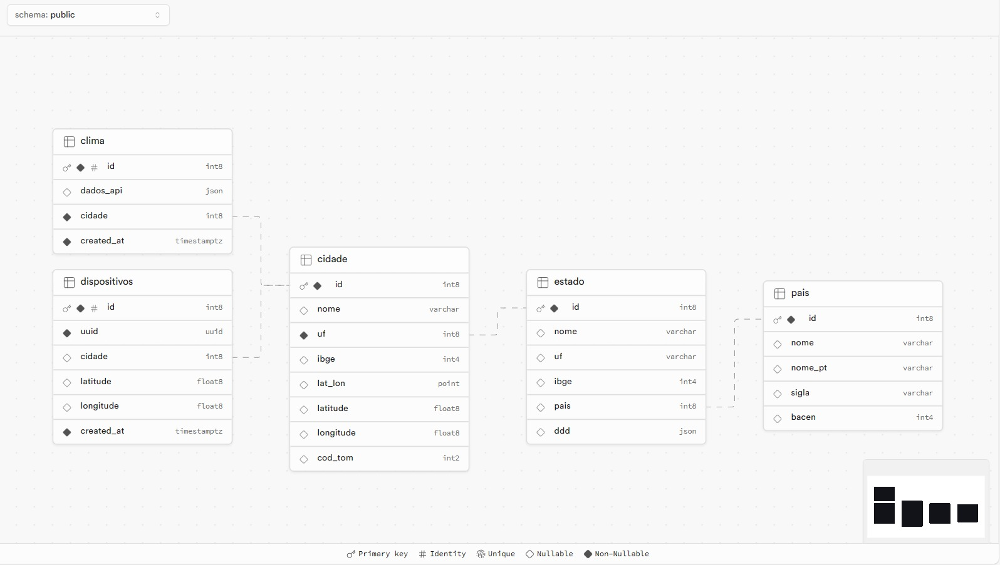

# APIs e Web Services

O projeto de backend da aplicação VaiChuve consiste em uma solução serveless hosteado no provedor de serviços SupaBase e utilizando serviços de
cloud functions e banco de dados on demand. 

## Objetivos da API

A API tem como objetivo ser leve e escalável para aguentar diversas cargas de workload dos usuários web e mobile e além disso entregar uma solução simples
de desenvolvimento e manutenção para que um pequeno pacote de dados seja entregue ao usuário de maneira rápida e confiável.

## Arquitetura

[Descrição da arquitetura das APIs, incluindo os componentes e suas interações.]

## Modelagem da Aplicação

Abaixo temos um overview geral da modelagem de dados que iremos utilizar na aplicação.
\\


## Fluxo de Dados

[Diagrama ou descrição do fluxo de dados na aplicação.]

## Requisitos Funcionais

[Liste os principais requisitos funcionais da aplicação.]

## Requisitos Não Funcionais

[Liste os principais requisitos não funcionais da aplicação, como desempenho, segurança, escalabilidade, etc.]

## Tecnologias Utilizadas

Existem muitas tecnologias diferentes que podem ser usadas para desenvolver APIs Web. A tecnologia certa para o seu projeto dependerá dos seus objetivos, dos seus clientes e dos recursos que a API deve fornecer.

[Lista das tecnologias principais que serão utilizadas no projeto.]

## API Endpoints

### Endpoint 1
- Método: GET
- URL: /cidade
- Parâmetros:
  - id: Identificador único da Cidade (bigint)
  - nome: Nome da Cidade (character varying)
  - uf: Identificador único do Estado (bigint)
  - ibge: Identificador único do IBGE (integer)
  - lat_lon: Lat e Long espacial (point)
  - latitude: Latitude (double precision)
  - longitude: Longitude (double precision)
  - cod_tom: Código TOM (SEFAZ) (smallint)
- Resposta:
  - Sucesso (200 OK)
    ```
    [
    	{
    		"id": 1,
    		"nome": "Nome da Cidade",
    		"uf": 1,
    		"ibge": 123456,
    		"lat_lon": "(12.3456789,-12.3456789)",
    		"latitude": 12.3456789,
    		"longitude": -12.3456789,
    		"cod_tom": 123
    	}
    ]
    ```
  - Erro (4XX, 5XX)
    ```
    {
      "message": "Error",
      "error": {
        ...
      }
    }
    ```

### Endpoint 2
- Método: GET
- URL: /clima
- Parâmetros:
  - id: No description (bigint)
  - dados_api: No description (json)
  - cidade: No description (bigint)
  - created_at: No description (timestamp with time zone)
- Resposta:
  - Sucesso (200 OK)
    ```
    [
    	{
    		"id": 1,
    		"dados_api": {},
    		"cidade": 1,
    		"created_at": "2024-03-21T00:56:39.991817+00:00"
    	}
    ]
    ```
  - Erro (4XX, 5XX)
    ```
    {
      "message": "Error",
      "error": {
        ...
      }
    }
    ```

### Endpoint 3
- Método: GET
- URL: /dispositivos
- Parâmetros:
  - id: No description (bigint)
  - uuid: No description (uuid)
  - cidade: No description (bigint)
  - latitude: No description (double precision)
  - longitude: No description (double precision)
  - created_at: No description (timestamp with time zone)
- Resposta:
  - Sucesso (200 OK)
    ```
    [
    	{
    		"id": 1,
    		"uuid": "some_uuid",
    		"cidade": 1,
    		"latitude": 12.3456789,
    		"longitude": -12.3456789,
    		"created_at": "2024-03-21T00:56:39.991817+00:00"
    	}
    ]
    ```
  - Erro (4XX, 5XX)
    ```
    {
      "message": "Error",
      "error": {
        ...
      }
    }
    ```

### Endpoint 4
- Método: GET
- URL: /estado
- Parâmetros:
  - id: No description (bigint)
  - nome: No description (character varying)
  - uf: No description (character varying)
  - ibge: No description (integer)
  - pais: No description (bigint)
  - ddd: No description (json)
- Resposta:
  - Sucesso (200 OK)
    ```
    [
    	{
    		"id": 1,
    		"nome": "Nome do Estado",
    		"uf": "UF",
    		"ibge": 123456,
    		"pais": 1,
    		"ddd": {}
    	}
    ]
    ```
  - Erro (4XX, 5XX)
    ```
    {
      "message": "Error",
      "error": {
        ...
      }
    }
    ```

### Endpoint 5
- Método: GET
- URL: /pais
- Parâmetros:
  - id: No description (bigint)
  - nome: No description (character varying)
  - nome_pt: No description (character varying)
  - sigla: ISO 3166-1 Alpha2 (character varying)
  - bacen: No description (integer)
- Resposta:
  - Sucesso (200 OK)
    ```
    [
    	{
    		"id": 1,
    		"nome": "Nome do País",
    		"nome_pt": "Nome do País em Português",
    		"sigla": "BR",
    		"bacen": 1234
    	}
    ]
    ```
  - Erro (4XX, 5XX)
    ```
    {
      "message": "Error",
      "error": {
        ...
      }
    }
    ```
### Endpoint 6
- Método: POST
- URL: /cidade
- Parâmetros:
  - id: Identificador único da Cidade (bigint)
  - nome: Nome da Cidade (character varying)
  - uf: Identificador único do Estado (bigint)
  - ibge: Identificador único do IBGE (integer)
  - lat_lon: Lat e Long espacial (point)
  - latitude: Latitude (double precision)
  - longitude: Longitude (double precision)
  - cod_tom: Código TOM (SEFAZ) (smallint)
- Corpo:
  ```
  {
    "nome": "Nome da Cidade",
    "uf": 1,
    "ibge": 123456,
    "lat_lon": "(12.3456789,-12.3456789)",
    "latitude": 12.3456789,
    "longitude": -12.3456789,
    "cod_tom": 123
  }
  ```
- Cabeçalhos:
  - apikey: PRIVATE_KEY
  - Authorization: Bearer PRIVATE_KEY
  - Content-Type: application/json
  - Prefer: return=minimal
- Resposta:
  - Sucesso (200 OK)
    ```
    {
      "message": "Success",
      "data": {
        ...
      }
    }
    ```
  - Erro (4XX, 5XX)
    ```
    {
      "message": "Error",
      "error": {
        ...
      }
    }
    ```

### Endpoint 7
- Método: POST
- URL: /clima
- Parâmetros:
  - id: No description (bigint)
  - dados_api: No description (json)
  - cidade: No description (bigint)
  - created_at: No description (timestamp with time zone)
- Corpo:
  ```
  {
    "dados_api": {},
    "cidade": 1
  }
  ```
- Cabeçalhos:
  - apikey: PRIVATE_KEY
  - Authorization: Bearer PRIVATE_KEY
  - Content-Type: application/json
  - Prefer: return=minimal
- Resposta:
  - Sucesso (200 OK)
    ```
    {
      "message": "Success",
      "data": {
        ...
      }
    }
    ```
  - Erro (4XX, 5XX)
    ```
    {
      "message": "Error",
      "error": {
        ...
      }
    }
    ```

### Endpoint 8
- Método: POST
- URL: /dispositivos
- Parâmetros:
  - id: No description (bigint)
  - uuid: No description (uuid)
  - cidade: No description (bigint)
  - latitude: No description (double precision)
  - longitude: No description (double precision)
  - created_at: No description (timestamp with time zone)
- Corpo:
  ```
  {
    "uuid": "some_uuid",
    "cidade": 1,
    "latitude": 12.3456789,
    "longitude": -12.3456789
  }
  ```
- Cabeçalhos:
  - apikey: PRIVATE_KEY
  - Authorization: Bearer PRIVATE_KEY
  - Content-Type: application/json
  - Prefer: return=minimal
- Resposta:
  - Sucesso (200 OK)
    ```
    {
      "message": "Success",
      "data": {
        ...
      }
    }
    ```
  - Erro (4XX, 5XX)
    ```
    {
      "message": "Error",
      "error": {
        ...
      }
    }
    ```

### Endpoint 9
- Método: POST
- URL: /estado
- Parâmetros:
  - id: No description (bigint)
  - nome: No description (character varying)
  - uf: No description (character varying)
  - ibge: No description (integer)
  - pais: No description (bigint)
  - ddd: No description (json)
- Corpo:
  ```
  {
    "nome": "Nome do Estado",
    "uf": "UF",
    "ibge": 123456,
    "pais": 1
  }
  ```
- Cabeçalhos:
  - apikey: PRIVATE_KEY
  - Authorization: Bearer PRIVATE_KEY
  - Content-Type: application/json
  - Prefer: return=minimal
- Resposta:
  - Sucesso (200 OK)
    ```
    {
      "message": "Success",
      "data": {
        ...
      }
    }
    ```
  - Erro (4XX, 5XX)
    ```
    {
      "message": "Error",
      "error": {
        ...
      }
    }
    ```

### Endpoint 10
- Método: POST
- URL: /pais
- Parâmetros:
  - id: No description (bigint)
  - nome: No description (character varying)
  - nome_pt: No description (character varying)
  - sigla: ISO 3166-1 Alpha2 (character varying)
  - bacen: No description (integer)
- Corpo:
  ```
  {
    "nome": "Nome do País",
    "nome_pt": "Nome do País em Português",
    "sigla": "BR",
    "bacen": 1234
  }
  ```
- Cabeçalhos:
  - apikey: PRIVATE_KEY
  - Authorization: Bearer PRIVATE_KEY
  - Content-Type: application/json
  - Prefer: return=minimal
- Resposta:
  - Sucesso (200 OK)
    ```
    {
      "message": "Success",
      "data": {
        ...
      }
    }
    ```
  - Erro (4XX, 5XX)
    ```
    {
      "message": "Error",
      "error": {
        ...
      }
    }
    ```
### Endpoint 11
- Método: PATCH
- URL: /cidade
- Parâmetros:
  - id: Identificador único da Cidade (bigint)
  - nome: Nome da Cidade (character varying)
  - uf: Identificador único do Estado (bigint)
  - ibge: Identificador único do IBGE (integer)
  - lat_lon: Lat e Long espacial (point)
  - latitude: Latitude (double precision)
  - longitude: Longitude (double precision)
  - cod_tom: Código TOM (SEFAZ) (smallint)
- Corpo:
  ```
  {
    "id": 1,
    "nome": "Novo Nome da Cidade",
    "uf": 2,
    "ibge": 654321,
    "lat_lon": "(11.1111111,-11.1111111)",
    "latitude": 11.1111111,
    "longitude": -11.1111111,
    "cod_tom": 456
  }
  ```
- Cabeçalhos:
  - apikey: PRIVATE_KEY
  - Authorization: Bearer PRIVATE_KEY
  - Content-Type: application/json
  - Prefer: return=minimal
- Resposta:
  - Sucesso (200 OK)
    ```
    {
      "message": "Success",
      "data": {
        ...
      }
    }
    ```
  - Erro (4XX, 5XX)
    ```
    {
      "message": "Error",
      "error": {
        ...
      }
    }
    ```

### Endpoint 12
- Método: PATCH
- URL: /clima
- Parâmetros:
  - id: No description (bigint)
  - dados_api: No description (json)
  - cidade: No description (bigint)
  - created_at: No description (timestamp with time zone)
- Corpo:
  ```
  {
    "id": 1,
    "dados_api": {"new_data": "new_value"}
  }
  ```
- Cabeçalhos:
  - apikey: PRIVATE_KEY
  - Authorization: Bearer PRIVATE_KEY
  - Content-Type: application/json
  - Prefer: return=minimal
- Resposta:
  - Sucesso (200 OK)
    ```
    {
      "message": "Success",
      "data": {
        ...
      }
    }
    ```
  - Erro (4XX, 5XX)
    ```
    {
      "message": "Error",
      "error": {
        ...
      }
    }
    ```

### Endpoint 13
- Método: PATCH
- URL: /dispositivos
- Parâmetros:
  - id: No description (bigint)
  - uuid: No description (uuid)
  - cidade: No description (bigint)
  - latitude: No description (double precision)
  - longitude: No description (double precision)
  - created_at: No description (timestamp with time zone)
- Corpo:
  ```
  {
    "id": 1,
    "uuid": "new_uuid",
    "cidade": 2,
    "latitude": 22.2222222,
    "longitude": -22.2222222
  }
  ```
- Cabeçalhos:
  - apikey: PRIVATE_KEY
  - Authorization: Bearer PRIVATE_KEY
  - Content-Type: application/json
  - Prefer: return=minimal
- Resposta:
  - Sucesso (200 OK)
    ```
    {
      "message": "Success",
      "data": {
        ...
      }
    }
    ```
  - Erro (4XX, 5XX)
    ```
    {
      "message": "Error",
      "error": {
        ...
      }
    }
    ```

### Endpoint 14
- Método: PATCH
- URL: /estado
- Parâmetros:
  - id: No description (bigint)
  - nome: No description (character varying)
  - uf: No description (character varying)
  - ibge: No description (integer)
  - pais: No description (bigint)
  - ddd: No description (json)
- Corpo:
  ```
  {
    "id": 1,
    "nome": "Novo Nome do Estado",
    "uf": "NN",
    "ibge": 987654,
    "pais": 2
  }
  ```
- Cabeçalhos:
  - apikey: PRIVATE_KEY
  - Authorization: Bearer PRIVATE_KEY
  - Content-Type: application/json
  - Prefer: return=minimal
- Resposta:
  - Sucesso (200 OK)
    ```
    {
      "message": "Success",
      "data": {
        ...
      }
    }
    ```
  - Erro (4XX, 5XX)
    ```
    {
      "message": "Error",
      "error": {
        ...
      }
    }
    ```

### Endpoint 15
- Método: PATCH
- URL: /pais
- Parâmetros:
  - id: No description (bigint)
  - nome: No description (character varying)
  - nome_pt: No description (character varying)
  - sigla: ISO 3166-1 Alpha2 (character varying)
  - bacen: No description (integer)
- Corpo:
  ```
  {
    "id": 1,
    "nome": "Novo Nome do País",
    "nome_pt": "Novo Nome do País em Português",
    "sigla": "NP",
    "bacen": 5678
  }
  ```
- Cabeçalhos:
  - apikey: PRIVATE_KEY
  - Authorization: Bearer PRIVATE_KEY
  - Content-Type: application/json
  - Prefer: return=minimal
- Resposta:
  - Sucesso (200 OK)
    ```
    {
      "message": "Success",
      "data": {
        ...
      }
    }
    ```
  - Erro (4XX, 5XX)
    ```
    {
      "message": "Error",
      "error": {
        ...
      }
    }
    ```
### Endpoint 16
- Método: DELETE
- URL: /cidade
- Parâmetros:
  - id: Identificador único da Cidade (bigint)
  - nome: Nome da Cidade (character varying)
  - uf: Identificador único do Estado (bigint)
  - ibge: Identificador único do IBGE (integer)
  - lat_lon: Lat e Long espacial (point)
  - latitude: Latitude (double precision)
  - longitude: Longitude (double precision)
  - cod_tom: Código TOM (SEFAZ) (smallint)
- Corpo:
  ```
  {
    "id": 1
  }
  ```
- Cabeçalhos:
  - apikey: PRIVATE_KEY
  - Authorization: Bearer PRIVATE_KEY

### Endpoint 17
- Método: DELETE
- URL: /clima
- Parâmetros:
  - id: No description (bigint)
  - dados_api: No description (json)
  - cidade: No description (bigint)
  - created_at: No description (timestamp with time zone)
- Corpo:
  ```
  {
    "id": 1
  }
  ```
- Cabeçalhos:
  - apikey: PRIVATE_KEY
  - Authorization: Bearer PRIVATE_KEY

### Endpoint 18
- Método: DELETE
- URL: /dispositivos
- Parâmetros:
  - id: No description (bigint)
  - uuid: No description (uuid)
  - cidade: No description (bigint)
  - latitude: No description (double precision)
  - longitude: No description (double precision)
  - created_at: No description (timestamp with time zone)
- Corpo:
  ```
  {
    "id": 1
  }
  ```
- Cabeçalhos:
  - apikey: PRIVATE_KEY
  - Authorization: Bearer PRIVATE_KEY

### Endpoint 19
- Método: DELETE
- URL: /estado
- Parâmetros:
  - id: No description (bigint)
  - nome: No description (character varying)
  - uf: No description (character varying)
  - ibge: No description (integer)
  - pais: No description (bigint)
  - ddd: No description (json)
- Corpo:
  ```
  {
    "id": 1
  }
  ```
- Cabeçalhos:
  - apikey: PRIVATE_KEY
  - Authorization: Bearer PRIVATE_KEY

### Endpoint 20
- Método: DELETE
- URL: /pais
- Parâmetros:
  - id: No description (bigint)
  - nome: No description (character varying)
  - nome_pt: No description (character varying)
  - sigla: ISO 3166-1 Alpha2 (character varying)
  - bacen: No description (integer)
- Corpo:
  ```
  {
    "id": 1
  }
  ```
- Cabeçalhos:
  - apikey: PRIVATE_KEY
  - Authorization: Bearer PRIVATE_KEY


## Considerações de Segurança

[Discuta as considerações de segurança relevantes para a aplicação distribuída, como autenticação, autorização, proteção contra ataques, etc.]

## Implantação

[Instruções para implantar a aplicação distribuída em um ambiente de produção.]

1. Defina os requisitos de hardware e software necessários para implantar a aplicação em um ambiente de produção.
2. Escolha uma plataforma de hospedagem adequada, como um provedor de nuvem ou um servidor dedicado.
3. Configure o ambiente de implantação, incluindo a instalação de dependências e configuração de variáveis de ambiente.
4. Faça o deploy da aplicação no ambiente escolhido, seguindo as instruções específicas da plataforma de hospedagem.
5. Realize testes para garantir que a aplicação esteja funcionando corretamente no ambiente de produção.

## Testes

[Descreva a estratégia de teste, incluindo os tipos de teste a serem realizados (unitários, integração, carga, etc.) e as ferramentas a serem utilizadas.]

1. Crie casos de teste para cobrir todos os requisitos funcionais e não funcionais da aplicação.
2. Implemente testes unitários para testar unidades individuais de código, como funções e classes.
3. Realize testes de integração para verificar a interação correta entre os componentes da aplicação.
4. Execute testes de carga para avaliar o desempenho da aplicação sob carga significativa.
5. Utilize ferramentas de teste adequadas, como frameworks de teste e ferramentas de automação de teste, para agilizar o processo de teste.

# Referências

Inclua todas as referências (livros, artigos, sites, etc) utilizados no desenvolvimento do trabalho.
