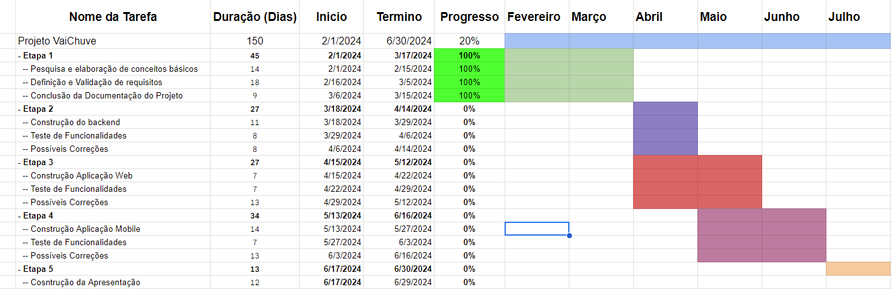

# Introdução

O Projeto VaiChuve tem como objetivo a criação de uma solução web e mobile que permita ao usuário acessar informações de previsões do tempo e histórico meteorológico, além de receber notificações com a previsão meteorológica diária em seu dispositivo móvel.

## Problema

Atualmente, existem várias informações meteorológicas disponíveis em diversos sistemas e aplicações. No entanto, é necessário realizar uma pesquisa mais direcionada para encontrar aplicações úteis e inclusivas para pessoas com deficiência visual. 

## Objetivos

O objetivo do projeto é integrar uma ferramenta no cotidiano do usuário, permitindo que ele consulte informações meteorológicas de forma rápida e receba notificações em tempo real sobre situações meteorológicas fora do comum. De maneira específica, pretendemos focar nossas pesquisas na criação de um sistema acessível para portadores de deficiência visual e que permita a notificação
de situações meterológicas incomuns via plataformas mobile.

## Justificativa

Atravez de pesquisas nos acervos mais comuns de aplicativos notamos uma dificuldade de encontrar soluções metereológicas que foquem no usuário com deficiencia visual e tomamos essa dor como motivação para a criação desse tipo de aplicação.

## Público-Alvo

O público alvo da aplicação são pessoas deficiente visuais que tem costume de usar de computadores e smartphones adaptados para suas nescessidades.

# Especificações do Projeto

A seguir temos alguns exemplo de usuário e suas dores que servirão de base na ilustração de do publico alvo do projeto.

## Personas

1 - Ana tem 30 anos e é uma escritora que perdeu a visão devido a uma condição genética quando era adolescente. Ela é uma pessoa independente e determinada, que não deixa sua deficiência visual limitar suas atividades diárias. Ana adora explorar novos lugares, ler livros em formato acessível e se manter atualizada sobre as notícias e o clima. Ela usa um smartphone com um software de leitura de tela e está sempre interessada em aplicativos e tecnologias que facilitem sua vida cotidiana.

2- João está planejando uma corrida matinal com seus amigos. Antes de sair de casa, ele verifica o aplicativo meteorológico e recebe uma notificação sobre uma tempestade iminente na área onde eles planejavam correr. Com essa informação, João avisa seus amigos e sugere adiar a corrida para outro dia mais seguro. Eles decidem seguir o conselho de João e aproveitam para planejar outra atividade indoor.

3 - Maria está se preparando para uma reunião importante com um cliente. Ela verifica o aplicativo meteorológico em seu smartphone, que possui uma interface acessível, e recebe uma notificação sobre a previsão de chuva forte na região onde ela terá a reunião. Com essa informação, ela se planeja para sair mais cedo de casa e evitar contratempos no trajeto.

## Histórias de Usuários

Com base na análise das personas forma identificadas as seguintes histórias de usuários:

|EU COMO... `PERSONA`        | QUERO/PRECISO ... `FUNCIONALIDADE` |PARA ... `MOTIVO/VALOR`                 |
|----------------------------|------------------------------------|----------------------------------------|
|Usuário (Deficiente Visual) | Consultar previsões de clima       | Planejar seu dia a dia                 |

### ANA
Ana, uma escritora com deficiência visual, planeja uma viagem para visitar sua família. Utilizando um aplicativo meteorológico altamente acessível, ela verifica a previsão do tempo e descobre uma tempestade iminente, optando por adiar sua viagem. Configurando o app para notificações em tempo real, Ana se sente segura ao saber que será informada sobre mudanças meteorológicas durante sua jornada, garantindo uma viagem tranquila e segura.

## Requisitos

As tabelas que se seguem apresentam os requisitos funcionais e não funcionais que detalham o escopo do projeto. 

### Requisitos Funcionais

|ID    | Descrição do Requisito                                                                                        | Prioridade |
|------|---------------------------------------------------------------------------------------------------------------|------------|
|RF-001| Permitir que o usuário consulte previsões metereológicas                                                      | ALTA       |
|RF-002| Permitir que o usuário consulte histórico de previsões metereológicas                                         | ALTA       | 
|RF-003| Permitir que o usuário mande um feedback sobre a previsão de tempo que ele recebeu                            | MÉDIA      |
|RF-004| Exibir na interface uma noticia do dia para o usuário                                                         | BAIXA      |
|RF-005| Permitir que o usuário participe em uma enquete de palpites sobre a situação metereológica dos próximos dias  | BAIXA      |

### Requisitos não Funcionais

|ID     | Descrição do Requisito  |Prioridade |
|-------|------------------------------------------------------------------------------------------------|------|
|RNF-001| O sistema deve contar com métodos de acessibilidade para deficiente visuais                    | ALTA | 
|RNF-002| O sistema deve enviar notificações para usuário para situações de chuva no local do usuário    | ALTA |
|RNF-002| O sistema deve rodar em plataformas web, android                                               | ALTA | 

## Restrições

O projeto está restrito pelos itens apresentados na tabela a seguir.

|ID| Restrição                                                                               |
|--|-----------------------------------------------------------------------------------------|
|01| O projeto deverá ser entregue até o final do semestre                                   |
|02| O desenvolvimento não irá atuar com programação mobile nativa                           |
|03| O projeto não irá incorporar práticas de inclusão de outras deficiências além da visual |

# Catálogo de Serviços

O projeto ira oferecer:

1 - Consulta de previsão metereológica.\
2 - Consulta de histórico de condições metereológicas.\
3 - Acessibilidade para deficiêntes visuais.\

# Gerenciamento de Projeto

## Gerenciamento de Tempo

Abaixo podemos ver um esboço do planjamento da construção do projeto./

# Arquitetura da Solução

Definição de como o software é estruturado em termos dos componentes que fazem parte da solução e do ambiente de hospedagem da aplicação.

## Tecnologias Utilizadas

Descreva aqui qual(is) tecnologias você vai usar para resolver o seu problema, ou seja, implementar a sua solução. Liste todas as tecnologias envolvidas, linguagens a serem utilizadas, serviços web, frameworks, bibliotecas, IDEs de desenvolvimento, e ferramentas.

Apresente também uma figura explicando como as tecnologias estão relacionadas ou como uma interação do usuário com o sistema vai ser conduzida, por onde ela passa até retornar uma resposta ao usuário.

## Hospedagem

Explique como a hospedagem e o lançamento da plataforma foi feita.

> **Links Úteis**:
>
> - [Website com GitHub Pages](https://pages.github.com/)
> - [Programação colaborativa com Repl.it](https://repl.it/)
> - [Getting Started with Heroku](https://devcenter.heroku.com/start)
> - [Publicando Seu Site No Heroku](http://pythonclub.com.br/publicando-seu-hello-world-no-heroku.html)
