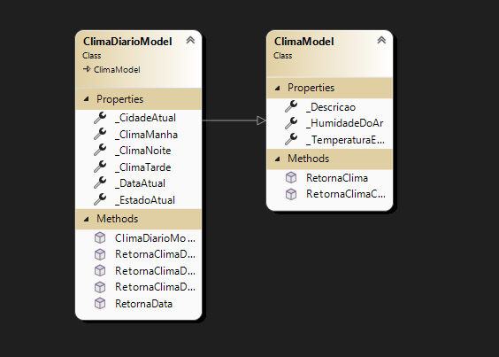
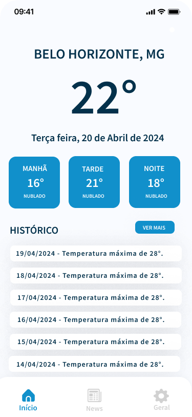
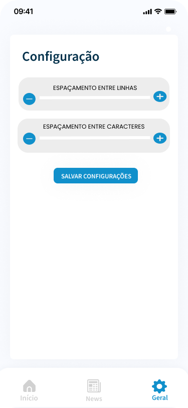

# Front-end Móvel

O Projeto VaiChuve Web pretende disponibilizar uma versão mobile da aplicação, especificamente para as plataformas android e ios, ultilizando as ferramentas de acessibilidade nativas das respectivas plataformas e comtemplar as nescessidades de portadores de diversos tipos de deficiências visuais ao proporcionar acesso a informações de clima e local.

## Tecnologias Utilizadas

1. NET MAUI (Multi-platform App UI)
2. C# 10.0
3. Microsoft .NET 8.0
4. CommunityToolkit.Maui
5. CommunityToolkit.Mvvm
6. Microsoft.Extensions.Logging.Debug

## Arquitetura

O projeto ultiliza a separação entre serviços (funcionalidades) em camadas. Além disso é utlilzado o modelo de arquitetura MVVM para controle de estado da aplicação.

## Modelagem da Aplicação

## Projeto da Interface
O sistema foi projetado para atender pessoas com deficiência visual, para uma melhor experiência do usuário, é necessário baixar o App Acessibilidade do Android, visto que a ferramenta tem a integração com as funcionalidades que esse App proporciona.

### Wireframes

### Design Visual
Utilizamos as cores azul #1190cb e branco. Como fonte utilizamos Helvética sem serifa, pois a mesma facilita a leitura para pessoas com deficiência visual leve.

### Layout Responsivo
O sistema foi projetado para atender qualquer dispositivo andriod, independente do tamanho da tela.

### Interações do Usuário
O sistema não possui o uso se animações e transições, o motivo é facilitar o uso para pessoas com deficiência visual e também facilitar o trabalho dos leitores de tela. Também é possível persolizar a visualização.

## Fluxo de Dados

[Diagrama ou descrição do fluxo de dados na aplicação.]

## Requisitos Funcionais

[Liste os principais requisitos funcionais da aplicação.]

## Requisitos Não Funcionais

[Liste os principais requisitos não funcionais da aplicação, como desempenho, segurança, escalabilidade, etc.]

## Considerações de Segurança

[Discuta as considerações de segurança relevantes para a aplicação distribuída, como autenticação, autorização, proteção contra ataques, etc.]

## Implantação

[Instruções para implantar a aplicação distribuída em um ambiente de produção.]

1. Defina os requisitos de hardware e software necessários para implantar a aplicação em um ambiente de produção.
2. Escolha uma plataforma de hospedagem adequada, como um provedor de nuvem ou um servidor dedicado.
3. Configure o ambiente de implantação, incluindo a instalação de dependências e configuração de variáveis de ambiente.
4. Faça o deploy da aplicação no ambiente escolhido, seguindo as instruções específicas da plataforma de hospedagem.
5. Realize testes para garantir que a aplicação esteja funcionando corretamente no ambiente de produção.

## Testes

[Descreva a estratégia de teste, incluindo os tipos de teste a serem realizados (unitários, integração, carga, etc.) e as ferramentas a serem utilizadas.]

1. Crie casos de teste para cobrir todos os requisitos funcionais e não funcionais da aplicação.
2. Implemente testes unitários para testar unidades individuais de código, como funções e classes.
3. Realize testes de integração para verificar a interação correta entre os componentes da aplicação.
4. Execute testes de carga para avaliar o desempenho da aplicação sob carga significativa.
5. Utilize ferramentas de teste adequadas, como frameworks de teste e ferramentas de automação de teste, para agilizar o processo de teste.

# Referências

Inclua todas as referências (livros, artigos, sites, etc) utilizados no desenvolvimento do trabalho.
