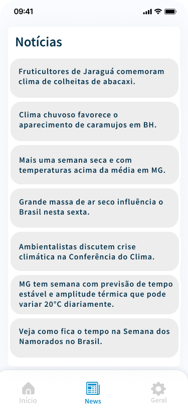

# Front-end Móvel

O Projeto VaiChuve Web pretende disponibilizar uma versão mobile da aplicação, especificamente para as plataformas android e ios, ultilizando as ferramentas de acessibilidade nativas das respectivas plataformas e comtemplar as nescessidades de portadores de diversos tipos de deficiências visuais ao proporcionar acesso a informações de clima e local.

## Tecnologias Utilizadas

1. NET MAUI (Multi-platform App UI)
2. C# 10.0
3. Microsoft .NET 8.0
4. CommunityToolkit.Maui
5. CommunityToolkit.Mvvm
6. Microsoft.Extensions.Logging.Debug

## Arquitetura

O projeto ultiliza a separação entre serviços (funcionalidades) em camadas. Além disso é utlilzado o modelo de arquitetura MVVM para controle de estado da aplicação.

## Modelagem da Aplicação

## Projeto da Interface
O sistema foi projetado para atender pessoas com deficiência visual. Para uma melhor experiência do usuário, é necessário baixar o App Acessibilidade do Android, visto que a ferramenta tem a integração com as funcionalidades que o nosso sistema proporciona.

### Wireframes

### Design Visual
Utilizamos as cores azul #1190cb e branco. Como fonte utilizamos Helvética sem serifa, pois a mesma facilita a leitura para pessoas com deficiência visual leve.

### Layout Responsivo
O sistema foi projetado para atender qualquer dispositivo andriod, independente do tamanho da tela.

### Interações do Usuário
O sistema não possui o uso se animações e transições, o motivo é facilitar o uso para pessoas com deficiência visual e também facilitar o trabalho dos leitores de tela. Também é possível personalizar a visualização.

## Requisitos Funcionais

- RF1: O usuário deve inserir manualmente sua localização ou utilizar o GPS para obter a previsão do tempo.
- RF2: O usuário deve visualizar a previsão do tempo para hoje, amanhã e os próximos dias.
- RF3: O usuário deve ver detalhes das condições climáticas, incluindo temperatura, sensação térmica, umidade e vento.
- RF4: O usuário deve poder favoritar cidades para acessar rapidamente suas previsões climáticas.
- RF5: O usuário deve poder aumentar o tamanho da fonte para melhor leitura. 

## Requisitos Não Funcionais

- RNF1: A aplicação deve ser totalmente compatível com leitores de tela populares.
- RNF2: Todas as informações meteorológicas devem ser acessíveis e compreensíveis através de leitores de tela, como NVDA, JAWS e VoiceOver.
- RNF3: As cores utilizadas na aplicação devem ter um contraste suficiente para serem legíveis, atendendo aos padrões WCAG 2.1 AA.
- RNF4: O tamanho da fonte deve ser configurável para permitir que usuários ajustem conforme suas necessidades.
- RNF5: Informações críticas, como alertas meteorológicos, devem ser fornecidas através de feedback auditivo claro e imediato.

## Considerações de Segurança

Ao desenvolver uma aplicação de clima com foco em acessibilidade para pessoas com deficiência visual, é crucial incorporar robustas considerações de segurança para proteger os dados dos usuários e garantir a integridade da aplicação. Isso inclui a implementação de protocolos de criptografia para proteger a transmissão de dados sensíveis, como informações de localização. Além disso, a aplicação deve estar equipada com medidas de autenticação e autorização para garantir que apenas usuários autorizados tenham acesso a funcionalidades específicas. É igualmente importante realizar testes de segurança regulares para identificar e corrigir vulnerabilidades, prevenindo ataques como SQL injection, cross-site scripting (XSS) e cross-site request forgery (CSRF). A proteção contra ataques DDoS (Distributed Denial of Service) também deve ser considerada para manter a disponibilidade da aplicação. Finalmente, é essencial garantir que a aplicação cumpra as regulamentações de privacidade e proteção de dados, como o GDPR (General Data Protection Regulation), para proteger os direitos dos usuários e evitar possíveis implicações legais.

## Implantação

1. Compilar o projeto e certifique-se de que a configuração de build está definida como "Release". 
2. Selecione a plataforma de destino como "Android".
3. Crie uma assinatura do APK.
   
bash
`
keytool -genkey -v -keystore release-key.jks -keyalg RSA -keysize 2048 -validity 10000 -alias my-key-alias
`

4. Siga as instruções para definir uma senha e informações da chave.
5. No Solution Explorer, clique com o botão direito no projeto e selecione "Propriedades", vá para a seção "Android Package Signing" e Marque a opção "Sign the .APK file using the following keystore details". Depois preencha os detalhes do keystore gerado.
6. Compilar o APK Assinado (No Visual Studio, defina a configuração de build como "Release") e Clique com o botão direito no projeto e selecione "Publicar".
7. Distribuir via Google Play Store:
8. Vá para o Google Play Console e faça login.
9. Crie um novo aplicativo e siga as instruções para preencher os detalhes do aplicativo.
10. Faça o upload do APK assinado e siga as instruções para publicação.

## Testes

[Descreva a estratégia de teste, incluindo os tipos de teste a serem realizados (unitários, integração, carga, etc.) e as ferramentas a serem utilizadas.]

1. Crie casos de teste para cobrir todos os requisitos funcionais e não funcionais da aplicação.
2. Implemente testes unitários para testar unidades individuais de código, como funções e classes.
3. Realize testes de integração para verificar a interação correta entre os componentes da aplicação.
4. Execute testes de carga para avaliar o desempenho da aplicação sob carga significativa.
5. Utilize ferramentas de teste adequadas, como frameworks de teste e ferramentas de automação de teste, para agilizar o processo de teste.

# Referências

* MICROSOFT. Creating Mobile Apps with .NET MAUI. 2022. Disponível em: https://docs.microsoft.com/en-us/dotnet/maui/get-started/first-app. Acesso em: 10 jun. 2024.
* MICROSOFT. Accessibility Best Practices for .NET MAUI. 2023. Disponível em: https://docs.microsoft.com/en-us/dotnet/maui/user-interface/accessibility. Acesso em: 10 jun. 2024.
* GOOGLE. Android Accessibility Overview. 2023. Disponível em: https://developer.android.com/guide/topics/ui/accessibility. Acesso em: 10 jun. 2024.
* MICROSOFT. .NET MAUI Accessibility Tools. 2023. Disponível em: https://docs.microsoft.com/en-us/dotnet/maui/tools/accessibility. Acesso em: 10 jun. 2024.
* W3C. Web Content Accessibility Guidelines (WCAG). 2021. Disponível em: https://www.w3.org/WAI/standards-guidelines/wcag/. Acesso em: 10 jun. 2024.
