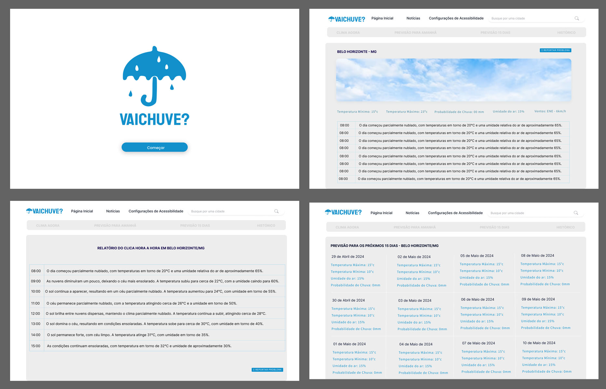

# Front-end Web

O Projeto VaiChuve Web pretende disponibilizar uma versão desktop da aplicação ultilizando as ferramentas de acessibilidade dos navegadores mais ultilizados atualmente e leva em consideração as nescessidades de portadores de diversos tipos de deficiências visuais ao proporcionar acesso a informações de clima e local.

## Tecnologias Utilizadas

- Next.js: Framework React para renderização do lado do servidor e criação de aplicações web rápidas e eficientes.
- React: Biblioteca JavaScript para construção de interfaces de usuário.
- Chakra UI: Biblioteca de componentes React para a criação de interfaces de usuário acessíveis e estilizadas.
- TypeScript: Superset de JavaScript que adiciona tipagem estática ao código.
- Tailwind CSS: Framework CSS utilitário para criar layouts customizados rapidamente.
- ESLint: Ferramenta de linting para garantir a qualidade e consistência do código.

## Arquitetura

A arquitetura da aplicação "vai-chuve" segue um modelo baseado em componentes, onde cada parte da interface é construída como um componente reutilizável e independente. Abaixo está uma descrição geral dos componentes principais e suas interações:\

- Componentes de Interface: Utilizando Chakra UI para construir componentes estilizados e responsivos.
- Context API / React Hooks: Utilizados para gerenciar o estado da aplicação, como dados meteorológicos e preferências do usuário.
- Fetch/Axios: Utilizados para realizar chamadas a APIs externas para obter dados meteorológicos.
- Tailwind CSS: Utilizado para estilização utilitária, permitindo a rápida criação de layouts personalizados.

## Projeto da Interface Web

A imagem a abaixo mostra como foi inicialmente planejado a estrutura visual do projeto, suas logos e imagens bem como os blocos de informação que a aplicação vai disponibilizar.

### Layout Responsivo

Para gerenciar a responsavidade da aplicação iremos ultilizar das ferramentas de responsividade da biblioteca da Chakra UI. Ela fornece componentes pré-estilizados e ferramentas como o Box e o Flex, que suportam propriedades responsivas diretamente, permitindo ajustes dinâmicos baseados nos pontos de interrupção (breakpoints) definidos. Com a utilização de breakpoints, é possível aplicar estilos diferentes conforme o tamanho da tela, garantindo que a interface se adapte harmoniosamente em dispositivos variados, desde celulares até desktops. Além disso, Chakra UI facilita a criação de layouts flexíveis e responsivos através de seus componentes de grade e sistema de espaçamento, contribuindo para uma experiência de usuário consistente e otimizada em qualquer resolução.

### Interações do Usuário

O projeto não ira ultilizar de ferramentas visuais de animação, transição, modais e estruturas complexas de representação visual afim de maximizar a compatibilidade da informação com as interfaces de acessebilidades disponibilizadas insfraestruturas das plataformas onde a aplicação será disponibilizada. Dito isso a projeto pretende atender boas práticas de contraste de cores e fontes para a facilitação da interpretação da informação por portadores de deficiências que levam a visibilidade reduzida.

## Fluxo de Dados

[Diagrama ou descrição do fluxo de dados na aplicação.]

## Requisitos Funcionais

1. ALTA:  O usuário deve poder pesquisar o clima atual e previsões futuras inserindo uma localização de cidade.
2. ALTA:  A aplicação deve atualizar automaticamente as informações climáticas diáriamente.
3. ALTA:  Mostrar dados como temperatura, umidade, velocidade do vento, e condições climáticas.
4. ALTA:  Descrição de Imagens: Incluir descrições alternativas (alt text) para todas as imagens e ícones utilizados, para que leitores de tela possam descrever essas imagens para usuários com deficiência visual.
5. MÉDIA: Implementar uma função que permita a narração das informações climáticas em voz alta.
6. MÉDIA: Garantir que todos os elementos da interface sejam acessíveis através de leitores de tela como NVDA, JAWS e VoiceOver.
7. BAIXA: Permitir que todas as funcionalidades da aplicação possam ser acessadas e operadas exclusivamente via teclado.
8. BAIXA: Oferecer um modo de alto contraste para usuários com baixa visão.

## Requisitos Não Funcionais

1. ALTA:  A aplicação deve carregar e responder rapidamente, com tempos de carregamento inferiores a 2 segundos em conexões padrão.
2. ALTA:  A arquitetura deve suportar um grande número de usuários simultâneos sem degradação perceptível de desempenho.
3. ALTA:  Garantir a proteção de dados do usuário, especialmente ao usar APIs de terceiros para obter dados climáticos.
4. ALTA:  A aplicação deve ser compatível com os navegadores mais utilizados, incluindo Chrome, Firefox, Safari e Edge.
5. ALTA:  A aplicação deve estar em conformidade com as diretrizes de acessibilidade WCAG 2.1, pelo menos no nível AA.
6. ALTA:  A interface deve ser intuitiva e fácil de usar, minimizando a curva de aprendizado para novos usuários.
7. ALTA:  A aplicação deve funcionar de forma consistente e estável, com uma taxa mínima de falhas ou bugs.

## Considerações de Segurança

Para garantir a segurança da aplicação "vai-chuve", adotamos diversas técnicas de segurança essenciais. Primeiramente, utilizamos HTTPS para assegurar que todas as comunicações entre o cliente e o servidor sejam criptografadas, protegendo os dados contra interceptações maliciosas. Implementamos validação e sanitização rigorosas dos dados de entrada para prevenir ataques de injeção, como SQL Injection e Cross-Site Scripting (XSS). A autenticação e autorização robustas são configuradas para garantir que apenas usuários autenticados e autorizados possam acessar determinadas funcionalidades e dados sensíveis. Utilizamos bibliotecas e dependências seguras, mantendo-as sempre atualizadas para evitar vulnerabilidades conhecidas. Também empregamos ferramentas de análise estática e dinâmica do código para identificar e corrigir vulnerabilidades antes que elas sejam exploradas. Além disso, monitoramos continuamente a aplicação para detectar e responder rapidamente a qualquer atividade suspeita ou tentativa de ataque.

## Implantação

1. Certifique-se de que o ambiente de produção tenha suporte para Node.js.
2. Garanta pelo menos 512MB de RAM para lidar com operações simultâneas.
3. Assegure uma conexão estável à internet para acessar APIs externas de meteorologia.
4. Utilize a plataforma Vercel para hospedar a aplicação devido à sua robustez e facilidade de integração com Next.js.
5. Acesse o painel de controle da Vercel.
6. Conecte o repositório GitHub que contém o código da aplicação.
7. No painel da Vercel, configure o projeto para instalar automaticamente todas as dependências listadas no package.json.
8. No painel da Vercel, vá para a seção de variáveis de ambiente.
9. Adicione todas as variáveis necessárias, como chaves de API para serviços de meteorologia, garantindo que estejam configuradas corretamente para o ambiente de produção.

## Referências

- VERCEL. Next.js - The React Framework for Production. Disponível em: https://nextjs.org/. Acesso em: 19 maio 2024.
- FACEBOOK. React – A JavaScript library for building user interfaces. Disponível em: https://reactjs.org/. Acesso em: 19 maio 2024.
- CHAKRA UI. Chakra UI - Simple, Modular and Accessible UI Components for React Applications. Disponível em: https://chakra-ui.com/. Acesso em: 19 maio 2024.
- MICROSOFT. TypeScript: JavaScript with syntax for types. Disponível em: https://www.typescriptlang.org/. Acesso em: 19 maio 2024.
- TAILWIND LABS. Tailwind CSS - A utility-first CSS framework for rapid UI development. Disponível em: https://tailwindcss.com/. Acesso em: 19 maio 2024.
- OPENJS FOUNDATION. ESLint - Find and fix problems in your JavaScript code. Disponível em: https://eslint.org/. Acesso em: 19 maio 2024.
- W3C. Web Content Accessibility Guidelines (WCAG) 2.1. Disponível em: https://www.w3.org/TR/WCAG21/. Acesso em: 19 maio 2024.
- NV ACCESS. NVDA - Free screen reader. Disponível em: https://www.nvaccess.org/. Acesso em: 19 maio 2024.
- FREEDOM SCIENTIFIC. JAWS Screen Reader. Disponível em: https://www.freedomscientific.com/products/software/jaws/. Acesso em: 19 maio 2024.
- APPLE. VoiceOver - Apple. Disponível em: https://www.apple.com/accessibility/vision/. Acesso em: 19 maio 2024.
- MOZILLA. HTTPS - Secure your site with HTTPS. Disponível em: https://developer.mozilla.org/en-US/docs/Web/Security/HTTP_strict_transport_security. Acesso em: 19 maio 2024.
- OWASP. OWASP Top Ten - Web Application Security Risks. Disponível em: https://owasp.org/www-project-top-ten/. Acesso em: 19 maio 2024.
- VERCEL. Vercel - Develop. Preview. Ship. For the best frontend teams. Disponível em: https://vercel.com/. Acesso em: 19 maio 2024.
