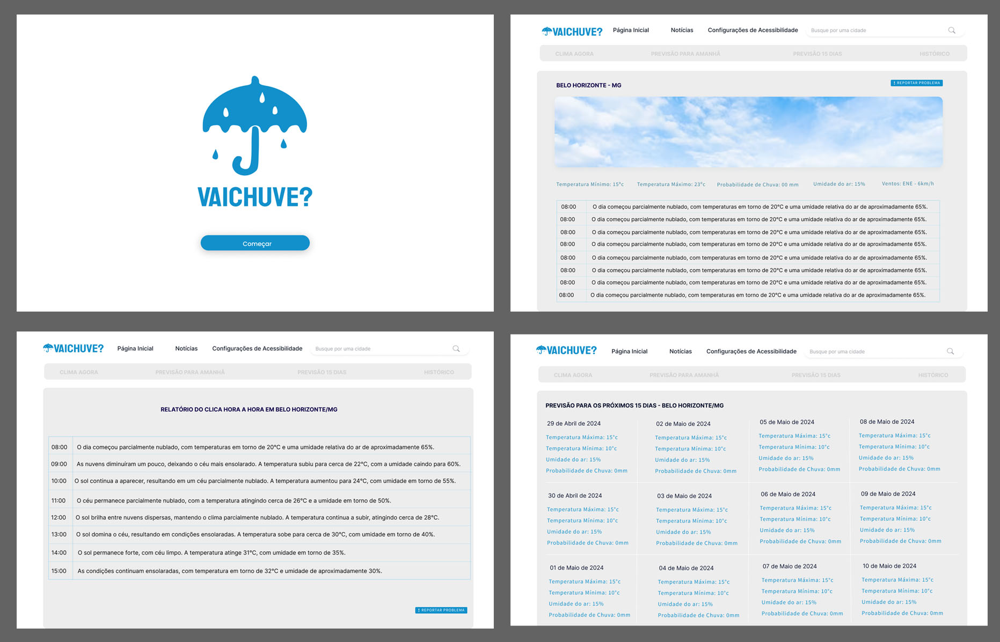

# Front-end Web

O Projeto VaiChuve Web pretende disponibilizar uma versão desktop da aplicação ultilizando as ferramentas de acessibilidade dos navegadores mais ultilizados atualmente e leva em consideração as nescessidades de portadores de diversos tipos de deficiências visuais ao proporcionar acesso a informações de clima e local.

## Tecnologias Utilizadas

- Next.js: Framework React para renderização do lado do servidor e criação de aplicações web rápidas e eficientes.
- React: Biblioteca JavaScript para construção de interfaces de usuário.
- Chakra UI: Biblioteca de componentes React para a criação de interfaces de usuário acessíveis e estilizadas.
- TypeScript: Superset de JavaScript que adiciona tipagem estática ao código.
- Tailwind CSS: Framework CSS utilitário para criar layouts customizados rapidamente.
- ESLint: Ferramenta de linting para garantir a qualidade e consistência do código.

## Arquitetura

A arquitetura da aplicação "vai-chuve" segue um modelo baseado em componentes, onde cada parte da interface é construída como um componente reutilizável e independente. Abaixo está uma descrição geral dos componentes principais e suas interações:\

- Componentes de Interface: Utilizando Chakra UI para construir componentes estilizados e responsivos.
- Context API / React Hooks: Utilizados para gerenciar o estado da aplicação, como dados meteorológicos e preferências do usuário.
- Fetch/Axios: Utilizados para realizar chamadas a APIs externas para obter dados meteorológicos.
- Tailwind CSS: Utilizado para estilização utilitária, permitindo a rápida criação de layouts personalizados.

## Modelagem da Aplicação
[Descreva a modelagem da aplicação, incluindo a estrutura de dados, diagramas de classes ou entidades, e outras representações visuais relevantes.]

## Projeto da Interface Web

A imagem a abaixo mostra como foi inicialmente planejado a estrutura visual do projeto, suas logos e imagens bem como os blocos de informação que a aplicação vai disponibilizar.

### Layout Responsivo
[Discuta como a interface será adaptada para diferentes tamanhos de tela e dispositivos.]

### Interações do Usuário

O projeto não ira ultilizar de ferramentas visuais de animação, transição, modais e estruturas complexas de representação visual afim de maximizar a compatibilidade da informação com as interfaces de acessebilidades disponibilizadas insfraestruturas das plataformas onde a aplicação será disponibilizada. Dito isso a projeto pretende atender boas práticas de contraste de cores e fontes para a facilitação da interpretação da informação por portadores de deficiências que levam a visibilidade reduzida.

## Fluxo de Dados

[Diagrama ou descrição do fluxo de dados na aplicação.]

## Requisitos Funcionais

[Liste os principais requisitos funcionais da aplicação.]

## Requisitos Não Funcionais

[Liste os principais requisitos não funcionais da aplicação, como desempenho, segurança, escalabilidade, etc.]

## Considerações de Segurança

[Discuta as considerações de segurança relevantes para a aplicação distribuída, como autenticação, autorização, proteção contra ataques, etc.]

## Implantação

[Instruções para implantar a aplicação distribuída em um ambiente de produção.]

1. Defina os requisitos de hardware e software necessários para implantar a aplicação em um ambiente de produção.
2. Escolha uma plataforma de hospedagem adequada, como um provedor de nuvem ou um servidor dedicado.
3. Configure o ambiente de implantação, incluindo a instalação de dependências e configuração de variáveis de ambiente.
4. Faça o deploy da aplicação no ambiente escolhido, seguindo as instruções específicas da plataforma de hospedagem.
5. Realize testes para garantir que a aplicação esteja funcionando corretamente no ambiente de produção.

## Testes

[Descreva a estratégia de teste, incluindo os tipos de teste a serem realizados (unitários, integração, carga, etc.) e as ferramentas a serem utilizadas.]

1. Crie casos de teste para cobrir todos os requisitos funcionais e não funcionais da aplicação.
2. Implemente testes unitários para testar unidades individuais de código, como funções e classes.
3. Realize testes de integração para verificar a interação correta entre os componentes da aplicação.
4. Execute testes de carga para avaliar o desempenho da aplicação sob carga significativa.
5. Utilize ferramentas de teste adequadas, como frameworks de teste e ferramentas de automação de teste, para agilizar o processo de teste.

# Referências

Inclua todas as referências (livros, artigos, sites, etc) utilizados no desenvolvimento do trabalho.
